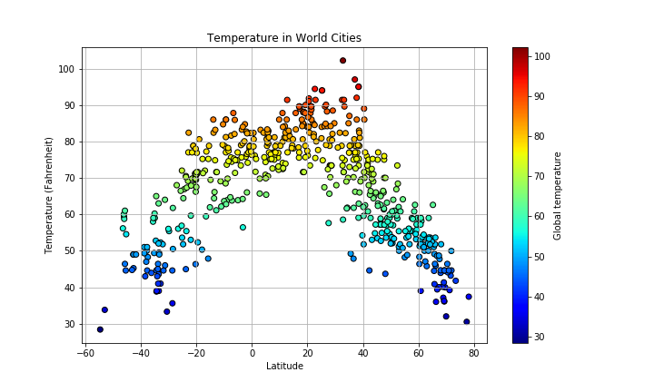
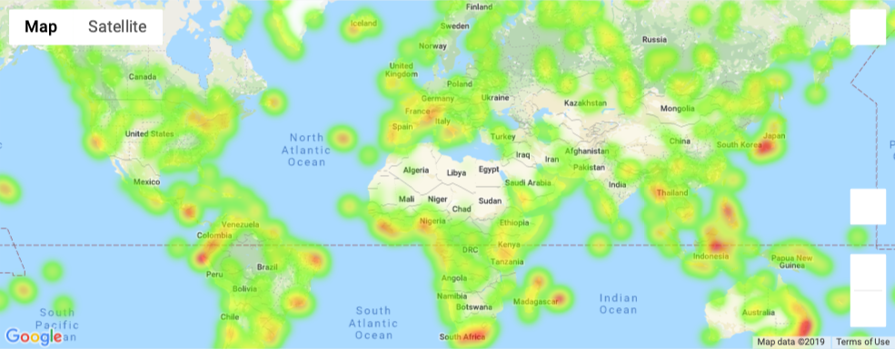

## Python & APIs - What's the Weather Like?

In this activity I used what I had learned about Python requests, APIs, and JSON traversals to answer some questions. I created a Python script to visualize the weather of 500+ cities across the world of varying distance from the equator. To accomplish this, I utilized a citipy, the OpenWeatherMap API and a few other Python libraries (matplotlib, scipy, pandas) to create a representative model of weather across world cities.

The first requirement was to create a series of scatter plots to showcase the following relationships:

* Temperature (F) vs. Latitude
* Humidity (%) vs. Latitude
* Cloudiness (%) vs. Latitude
* Wind Speed (mph) vs. Latitude

The next objective was to run a linear regression on each relationship, only this time separating them into Northern Hemisphere (greater than or equal to 0 degrees latitude) and Southern Hemisphere (less than 0 degrees latitude):

* Northern Hemisphere - Temperature (F) vs. Latitude
* Southern Hemisphere - Temperature (F) vs. Latitude
* Northern Hemisphere - Humidity (%) vs. Latitude
* Southern Hemisphere - Humidity (%) vs. Latitude
* Northern Hemisphere - Cloudiness (%) vs. Latitude
* Southern Hemisphere - Cloudiness (%) vs. Latitude
* Northern Hemisphere - Wind Speed (mph) vs. Latitude
* Southern Hemisphere - Wind Speed (mph) vs. Latitude

After running analysis on the weather data I used the information to imagin a plan for future vacations. Jupyter-gmaps and the Google Places API were used for this part of the activity.  A heat map was created that displays the humidity for every city from the part I.

  

Then I narrowed down the DataFrame to find my ideal weather condition.

Using Google Places API I found the first hotel for each city located within 5000 meters of it's coordinates and, ploted the hotels on top of the humidity heatmap with each pin containing the **Hotel Name**, **City**, and **Country**.

  

full .ipynb files are located in this repositiry.